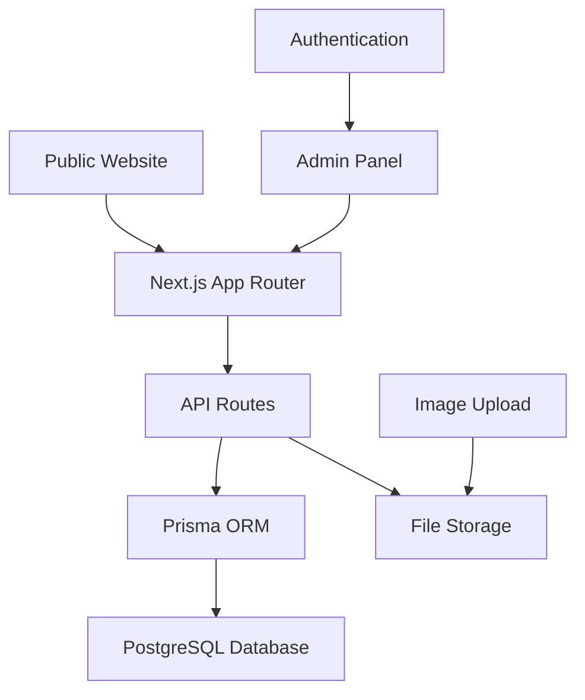

# Design Document

## Overview

The AI Reels Platform is a full-stack web application built with Next.js 14 (App Router), TypeScript, and Tailwind CSS. The system consists of two main interfaces: a public-facing website for browsing AI reels and a secure admin panel for content management. The application uses Prisma ORM with PostgreSQL for data persistence and implements secure authentication for admin access.

## Architecture

### High-Level Architecture



### Technology Stack

- **Frontend**: Next.js 14 with App Router, React 19, TypeScript
- **Styling**: Tailwind CSS 4
- **Database**: PostgreSQL with Prisma ORM
- **Authentication**: NextAuth.js or custom JWT implementation
- **File Storage**: Local file system or cloud storage (Vercel Blob)
- **Deployment**: Vercel
- **Image Handling**: Next.js Image component with optimization

### Project Structure

```
├── app/
│   ├── (public)/
│   │   ├── page.tsx                 # Public homepage
│   │   ├── layout.tsx               # Public layout
│   │   └── components/
│   │       ├── Hero.tsx
│   │       ├── ReelsGrid.tsx
│   │       ├── CategoryFilter.tsx
│   │       └── ImageSlider.tsx
│   ├── admin/
│   │   ├── login/
│   │   │   └── page.tsx             # Admin login
│   │   ├── dashboard/
│   │   │   ├── page.tsx             # Admin dashboard
│   │   │   ├── reels/
│   │   │   │   ├── page.tsx         # Reels management
│   │   │   │   └── [id]/
│   │   │   │       └── page.tsx     # Edit reel
│   │   │   └── slider/
│   │   │       └── page.tsx         # Slider management
│   │   └── layout.tsx               # Admin layout
│   ├── api/
│   │   ├── auth/
│   │   │   └── route.ts             # Authentication endpoints
│   │   ├── reels/
│   │   │   ├── route.ts             # CRUD operations for reels
│   │   │   └── [id]/
│   │   │       └── route.ts         # Individual reel operations
│   │   ├── slider/
│   │   │   └── route.ts             # Slider content management
│   │   └── upload/
│   │       └── route.ts             # File upload handling
│   ├── globals.css
│   └── layout.tsx
├── lib/
│   ├── prisma.ts                    # Prisma client
│   ├── auth.ts                      # Authentication utilities
│   ├── utils.ts                     # General utilities
│   └── validations.ts               # Zod schemas
├── prisma/
│   ├── schema.prisma                # Database schema
│   └── seed.ts                      # Database seeding
├── components/
│   ├── ui/                          # Reusable UI components
│   └── shared/                      # Shared components
├── __tests__/                       # All test files
│   ├── components/
│   ├── api/
│   ├── utils/
│   └── integration/
├── public/
│   └── uploads/                     # Uploaded images
└── types/
    └── index.ts                     # TypeScript type definitions
```

## Components and Interfaces

### Public Website Components

#### Hero Component
- Displays logoipsum branding
- Responsive banner with call-to-action
- WhatsApp integration button

#### CategoryFilter Component
- Filter buttons: All, Clothing, Branding, Fashion
- Active state management
- Smooth filtering animations

#### ReelsGrid Component
- Responsive grid layout (1-4 columns based on screen size)
- Reel cards with thumbnails
- "Order Now" buttons with WhatsApp integration
- Lazy loading for performance

#### ImageSlider Component
- Configurable heading and subheading
- Auto-rotating image carousel
- Touch/swipe support for mobile
- Pagination indicators

### Admin Panel Components

#### AdminLayout Component
- Dark theme sidebar navigation
- logoipsum branding
- Navigation menu (Hero, Stats, Our Work, Reels, Category, etc.)
- Logout functionality

#### LoginForm Component
- Email and password fields
- Remember me checkbox
- Form validation
- Error handling

#### ReelManagement Component
- Add/Edit reel form
- Category selection (multi-select checkboxes)
- Thumbnail upload with preview
- Reel link input
- CRUD operations interface

#### SliderManagement Component
- Heading/subheading text editors
- Image upload interface
- Image reordering functionality
- Preview of slider content

### API Interfaces

#### Authentication API
```typescript
// POST /api/auth/login
interface LoginRequest {
  email: string;
  password: string;
  rememberMe?: boolean;
}

interface LoginResponse {
  success: boolean;
  token?: string;
  user?: AdminUser;
  error?: string;
}
```

#### Reels API
```typescript
// GET /api/reels
interface ReelsResponse {
  reels: Reel[];
  total: number;
}

// POST /api/reels
interface CreateReelRequest {
  link: string;
  categories: string[];
  thumbnail: File;
  title: string;
}
```

#### Slider API
```typescript
// GET /api/slider
interface SliderResponse {
  heading: string;
  subheading: string;
  images: SliderImage[];
}

// PUT /api/slider
interface UpdateSliderRequest {
  heading?: string;
  subheading?: string;
  images?: File[];
}
```

## Data Models

### Database Schema

```prisma
model Admin {
  id        String   @id @default(cuid())
  email     String   @unique
  password  String
  createdAt DateTime @default(now())
  updatedAt DateTime @updatedAt
}

model Reel {
  id         String     @id @default(cuid())
  title      String
  link       String
  thumbnail  String
  categories Category[]
  createdAt  DateTime   @default(now())
  updatedAt  DateTime   @updatedAt
}

model Category {
  id    String @id @default(cuid())
  name  String @unique
  reels Reel[]
}

model SliderContent {
  id         String        @id @default(cuid())
  heading    String
  subheading String
  images     SliderImage[]
  createdAt  DateTime      @default(now())
  updatedAt  DateTime      @updatedAt
}

model SliderImage {
  id              String        @id @default(cuid())
  url             String
  order           Int
  sliderContentId String
  sliderContent   SliderContent @relation(fields: [sliderContentId], references: [id])
}
```

### TypeScript Types

```typescript
interface Reel {
  id: string;
  title: string;
  link: string;
  thumbnail: string;
  categories: Category[];
  createdAt: Date;
  updatedAt: Date;
}

interface Category {
  id: string;
  name: 'Clothing' | 'Branding' | 'Fashion';
  reels: Reel[];
}

interface SliderContent {
  id: string;
  heading: string;
  subheading: string;
  images: SliderImage[];
}

interface SliderImage {
  id: string;
  url: string;
  order: number;
}

interface AdminUser {
  id: string;
  email: string;
}
```

## Error Handling

### Client-Side Error Handling
- Form validation with Zod schemas
- Toast notifications for user feedback
- Loading states for async operations
- Error boundaries for component failures

### Server-Side Error Handling
- API route error responses with proper HTTP status codes
- Database connection error handling
- File upload error management
- Authentication error handling

### Error Response Format
```typescript
interface ErrorResponse {
  success: false;
  error: string;
  code?: string;
  details?: any;
}
```

## Testing Strategy

### Test Organization
All tests will be organized in a centralized `__tests__` folder with the following structure:
- `__tests__/components/` - Component unit tests
- `__tests__/api/` - API route tests
- `__tests__/utils/` - Utility function tests
- `__tests__/integration/` - Integration tests

### Testing Approach

#### Unit Tests
- Component rendering and behavior testing with React Testing Library
- API route testing with Jest
- Utility function testing
- Database model validation testing

#### Integration Tests
- End-to-end user flows
- API integration testing
- Database operations testing
- Authentication flow testing

#### Test Coverage Goals
- Minimum 80% code coverage
- All critical user paths covered
- All API endpoints tested
- All form validations tested

### Testing Tools
- **Jest**: Test runner and assertion library
- **React Testing Library**: Component testing
- **MSW (Mock Service Worker)**: API mocking
- **Prisma Test Environment**: Database testing

## Security Considerations

### Authentication Security
- Password hashing with bcrypt
- JWT token implementation with secure httpOnly cookies
- Session management with proper expiration
- CSRF protection

### Data Validation
- Input sanitization on all forms
- File upload validation (type, size, content)
- SQL injection prevention through Prisma
- XSS prevention through proper escaping

### Access Control
- Protected admin routes with middleware
- Role-based access control
- Secure file upload handling
- Environment variable protection

## Performance Optimization

### Image Optimization
- Next.js Image component for automatic optimization
- Lazy loading for reel thumbnails
- WebP format conversion
- Responsive image sizing

### Caching Strategy
- Static generation for public pages
- API response caching where appropriate
- Image caching with proper headers
- Database query optimization

### Bundle Optimization
- Code splitting for admin and public sections
- Tree shaking for unused code
- Dynamic imports for heavy components
- Webpack bundle analysis

## Deployment Configuration

### Vercel Deployment
- Environment variables configuration
- Database connection setup
- File upload storage configuration
- Build optimization settings

### Environment Variables
```
DATABASE_URL=postgresql://...
NEXTAUTH_SECRET=...
NEXTAUTH_URL=...
UPLOAD_DIR=...
```

### Build Process
- TypeScript compilation
- Tailwind CSS optimization
- Prisma client generation
- Database migration execution